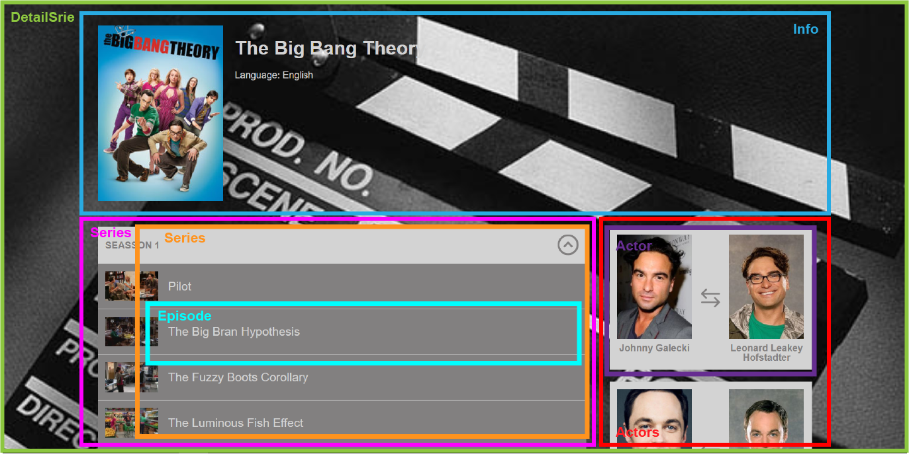

# Creando la ruta Detail

Ahora que tenemos configurado nuestro router podemos añadir mas rutas a nuestra **SPA**, en este caso vamos a añadir la ruta del detalle de serie. Primero vamos a ver la página para ver la separación de componentes y generar la estructura de ellos.



Ahora que tenemos separado visualmente los componentes que necesitamos con los nombres y la estructura que se va a hacer, podemos generar la estructura de carpetas y componentes en el proyecto.


De esta manera quedaría la estructura de carpetas para los componentes que vamos a usar para la página de detalle.

Vamos a añadir nuestra nueva ruta en el fichero **routes.js**.

```javascript
import React from 'react';
import { Route, Switch } from 'react-router-dom';

import { MasterSeries } from './modules/series/MasterSeries';
import { DetailSerie } from './modules/series/DetailSerie';

const Routes = () => 
    <Switch>
        <Route exact path='/series' component={ MasterSeries } />
        <Route path='/series/:id' component={ DetailSerie } />
    </Switch>


export { Routes }
```

El exact lo que nos va a indicar es que se renderice cuando la ruta machee exactamente con lo que hemos indicado por que si no cuando pusiesemos **/eries/1** cogeria esta, ya que para el machearía completamente y es la primera en el orden del **<Switch>**

Para comprobar que se renderiza nuestra ruta cuando navegamos a **/series/1** vamos a poner un texto de ejemplo en el componente.

**DetailSerie.js**

```javascript
import React from 'react';

const DetailSerie = () =>
    <span>Detail Page</span>

export { DetailSerie }
```

Si ahora navegamos a la ruta **/series/1** veremos que en pantalla aparece el texto **Detail Page** pero si ponemos **/series** se nos renderizara nuestra lista de series que hemos hecho en los pasos anteriores.

Ahora lo que vamos a hacer es crear los links en nuestra **SerieCard** para que cuando clickemos en ella nos mande a su detalle, como hemos definido que la ruta de detalle sea **/series/:id** el id representara el id de la serie que luego mas a delante pediremos al API. Para conseguir eso, vamos a crear un link.

**SerieCard.js**

```javascript
import React from 'react';
import { Link } from 'react-router-dom';

const SerieCard = ({ serie }) => 
    <Link to={ `/series/${serie.id}` }>
        <div>
            
            <h2>{ serie.title }</h2>
            <span>Language: { serie.language }</span>
        </div>
    </Link>

export { SerieCard }
```

Lo que hemos hecho en este caso es crear un **<Link>** que nos ofrece **react-router-dom**