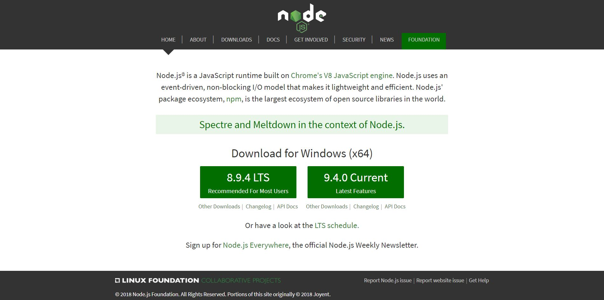
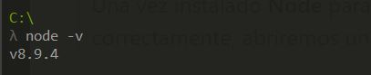
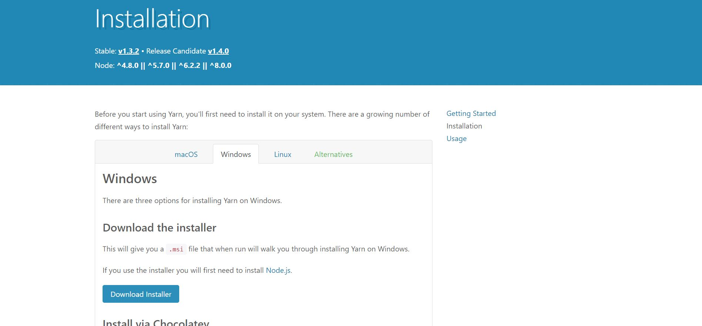
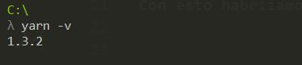
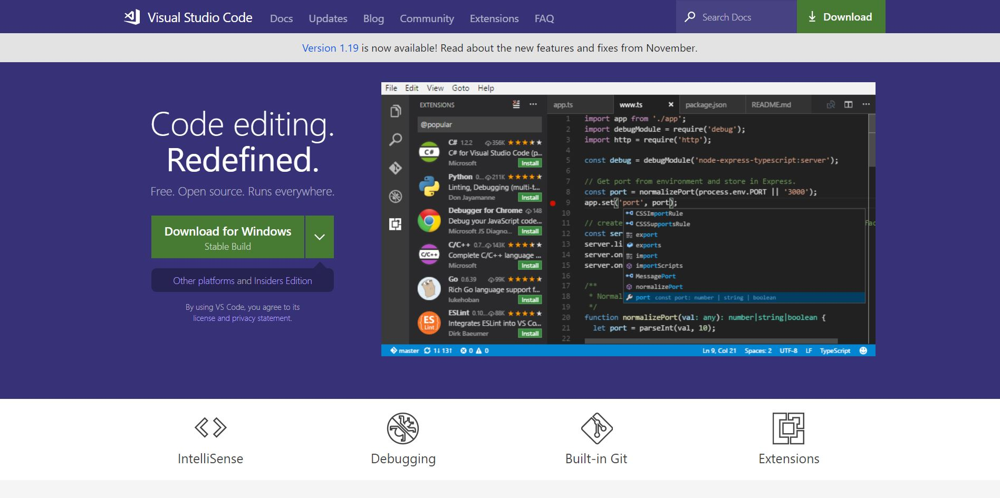
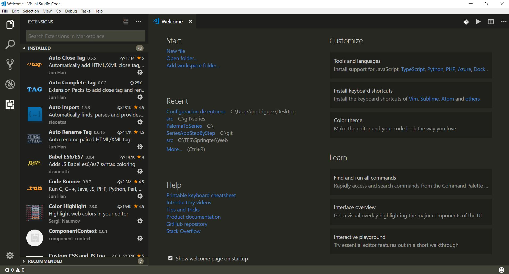
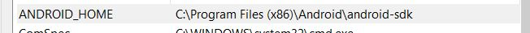

# Configuración de entorno

## 1- Instalar Node

Para instalar **Node** tenemos que irnos a la [página oficial de Node](https://nodejs.org/en/) donde nos aparecerán dos versiones de **Node** para descargar. Instalaremos la recomendada, ay que hay ocasiones que las ultimas versiones no funcionan con todos los paquetes.



Cuando se haya descargado el ejecutable lanzaremos la instalación, dejaremos todos los pasos que vienen por defecto.

Una vez instalado **Node** para comprobar si se ha instalado correctamente, abriremos una coonsola de comandos y ejecutaremos

```
node -v 
```

Cuando ejecutemos el comando debería de reconocer nuestro comando y debería mostrarnos la version de node que tenemos.



Con esto habriíamos acabado la instalación de **Node**


## 2- Instalación Yarn

Por defecto **Node** viene ya con un manejador de paquetes que es **npm** pero nosotros vamos a instalar **yarn** que es otro manejador de paquetes.

**Yarn** nos da un mayor performance, offline cache que nos permite instalar aquellos paquetes que ya hemos instalado alguna vez en el pc sin conexión y tiene un nuevo algoritmo de instalación que nos va hacer olvidar **"En mi máquina funciona"**.

Para instalarnos **yarn** nos vamos a la [página oficial de yarn](https://yarnpkg.com/lang/en/docs/install/) y nos descargamos el instalador de la plataforma de nuestro pc.



Ejecutamos el instalador dejando todos los pasos que vienen por defecto.

Cuando haya terminado la instalación abrimos una consola de comandos y ejecutaremos el comando

```
yarn -v
```

Cuando ejecutemos el comando debería de reconocer nuestro comando y debería mostrarnos la version de node que tenemos.



Con esto habriíamos acabado la instalación de **Yarn**.

## 3- Instalación IDE

En este caso vamos a instalar **Visual Studio Code**. Si preferís usar otro IDE por que ya habeís trabajado con el no hay ningun problema.

Para instalas **Visual Studio Code** nos iremos a la [página oficial de Visual Studio Code](https://code.visualstudio.com/) y nos descargaremos el instalador de nuestra plataforma.



Una vez descargado, intalaremos **Visual Studio Code**. Si queremos que nos genere un icono en el escritorio y que os añada la opcion de **"Abrir con"** cuando hagamos **"Boton derecho"**, lo indicamos en uno de los pasos de instalación, el esto lo haremos por defecto.

Cuando hayamos instalado **Visual Studio Code** vamos a ejecutar el programa y vamos a instalar extensiones que nos faciliten un poco el trabajo.

Si nos fijamos, en el lado izquierdo tenemos una barra en el cual nos aparece la opcion de **extensiones** que es el último icono.



En mi caso recomiendo instalar las extensiones:

* Auto Close Tag
* Auto Complete Tag
* Auto Rename Tag
* Babel ES6/ES7
* Color Highlight
* Debugger for Chrome
* ESLint
* HTML Snippets
* HTMLHint
* Material Icon Theme
* Node Debug 2
* Prettier - Code formatter
* Raimbow Brackets
* React Native Tools
* Settings Sync
* Stylelint

Con esto tendríamos instalado **Visual Studio Code**.


## 4- Intalación Expo XDE

Para aquellos que esten interesados en hacer aplicaciones con **React-Native** vamos a instalar **Expo XDE**.


**Expo** es una biblioteca nativa de Javascript que proporciona acceso a la funcionalidad del sistema del dispositivo (camara, contactos almacenamiento local, etc). Eso significa que no necesitamos usar **XCode** o **Android Studio** ni escribir ningún código nativo.

**Expo** Nos permite desarrollar aplicaciones para **IOS** desde**windows** sin necesidad de tener un **mac** para compilar la apliacación.

Para descargarnos **Expo** accederemos al [link de descarga](https://xde-updates.exponentjs.com/download/win32).

Una vez descargado el instalador, lo ejecutamos e instalamos **Expo**. Cuando se haya instalado si abrimos el programa, nos va a pedir que nos logueemos con una cuenta de **GitHub** o que nos registremos, una vez que hayamos hecho ese paso, ya podremos empezar a usarlo.

## 5- Instalación Android SDK

Para poder ejecutar nuestras aplicaciones de **React-Native** en un **emulador Android** o ejecutarlo en nuestro dispositivo a través del cable, necesitamos tener el instalado **Android SDK**. Si lo queremos ejecutar a traves de la **LAN** no sera necesario instalarlo.

Lo primero es instalar **Java JDK** para eso tenemos que ir a la [página de Oracle](http://www.oracle.com/technetwork/es/java/javase/downloads/jdk-netbeans-jsp-3413139-esa.html) y descargarlo.

Una vez descargado vamos a ejecutar el instalador, en el paso de la ruta de instalación, vamos a copiarnos el path para usarlo despues.

Una vez instalado, tenemos que ver si se ha configurado la variable de entorno **JAV_HOME**, de no ser así, nos vamos a ``` propiedades del sistema > variables de entorno``` y en el apartado **variables de sistema** tenemos que tener una variable **JAVA_HOME** de no ser así la crearemos apuntando a la ruta que hemos copiado en el paso anterior.


Cuando tengamos **JAVA_HOME** configurado, tenemos que descargarnos el **Android SDK** para ello nos vamos a ir a la [página de android](https://developer.android.com/sdk/download.html) y nos vamos a descargar el **Android SDK**, ejecutamos el instalador y dejamos los pasos por defecto. Una vez instalado tenemos que configurar la variable de entorno **ANDROID_HOME**, para ello volvemos a ``` propiedades del sistema > variables de entorno``` y si no la tenemos configurada lo configuramos con la ruta donde se encuentra el fichero **SDK Manager.exe** en mi caso sería.



Ahora tenemos que instalar las **APIs** de **Android** que queramos instalar, si nos vamos donde estaba nuesto **SDK Manager.exe** y lo ejecutamos nos aparecera una ventana donde podremos instalar todas las **APIs** que queramos.

Para el emulador podemos usar los emuladores de **Android Studio** (Tendríamos que instalarlo) o podemos usar [GenyMotion](https://www.genymotion.com/).