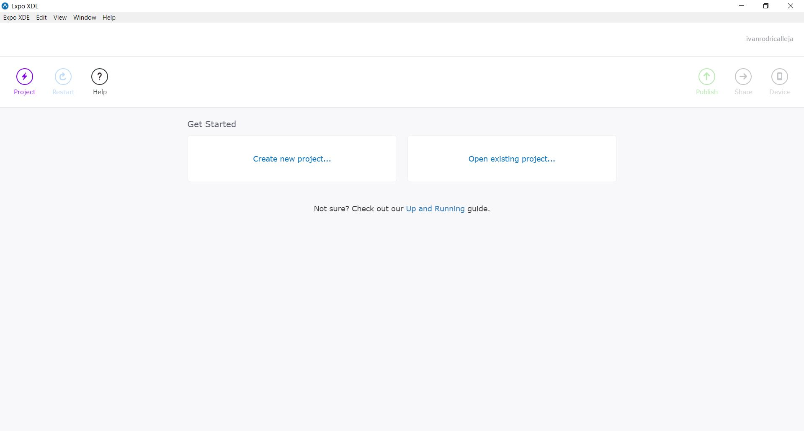
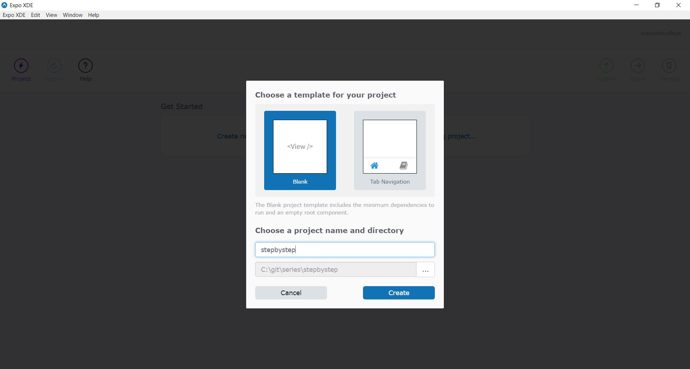
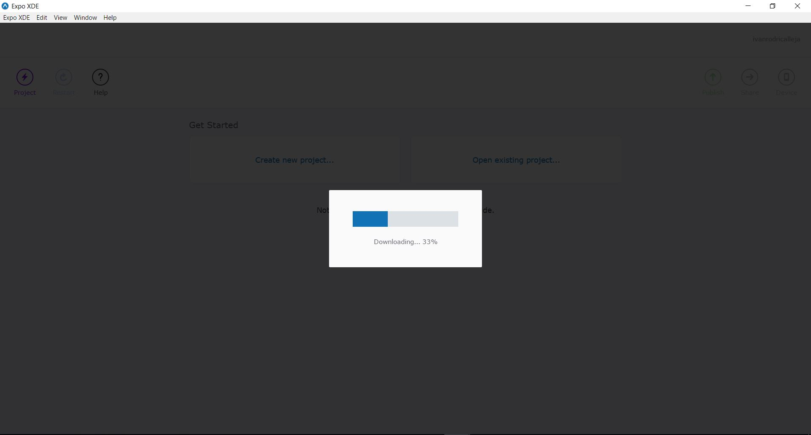
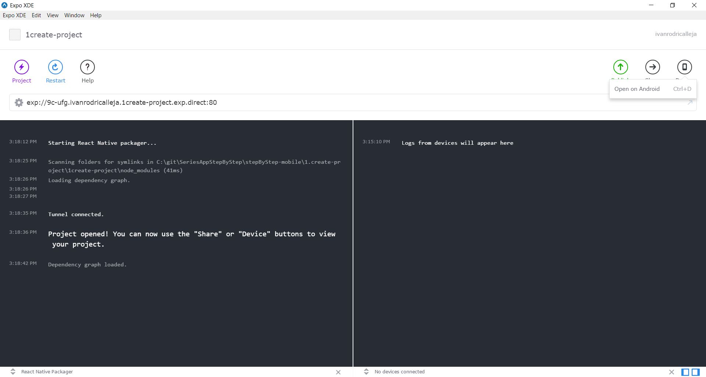
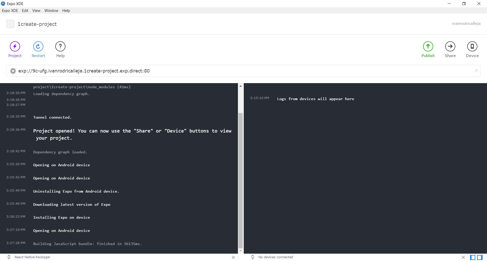
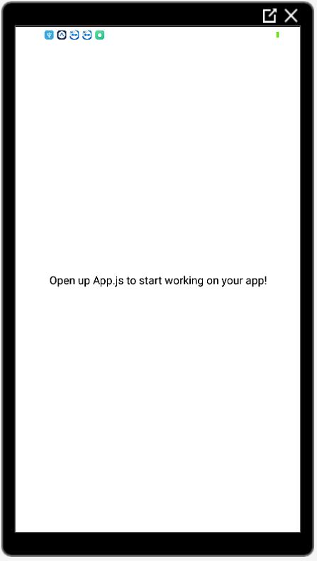
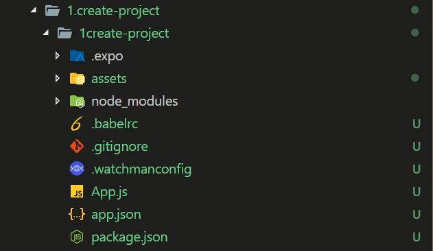

# Crear proyecto con Expo

Para empezar a desarrollar la apliacación **React-Native** vamos a hacer a través de **Expo**, también podríamos hacerlo con **React native cli**.

Para crear el proyecto nos vamos a ir a la aplicación de escritorio que nos hemos descargado de **Expo** Y vamos a seleccionar **Create new projecy...**

Una vez seleccionado nos aparecerá un modal donde vamos a elegir el tipo de aplicación que queremos crear y en que carpeta lo vamos a hacer. En este caso vamos a crear una aplicación en blanco.

Cuando le pulsemos **Create** si es el primer proyecto de **Expo** con ese template que creamos, empezará a descargarse los ficheros del proyecto.

Una vez haya terminado la descarga y se haya generado el proyecto, en la apliacación **Expo** comenzara un proceso que nos va a permitir lanzar la aplicación en un dispositivo fisico o emulador.

Si nos fijamos en la parte de arriba a la derecha, nos da la opción **Open on Android**, si pulsamos, nos comenzará el proceso de bundle de la aplicación el cual nos va a pedir permisos en el dispositivo para poder instalar **Expo client** en el dispositivo, a través del cual vamos a usar en desarrollo. A través de expo client también podriamos ejecutarlo en **IOS** pero la aplicación **Expo client** para **IOS** tendriamos que descargarla nosotros mismo de la **Apple Store**.

Como podemos ver, al ser la primera vez que se ejecuta la aplicación **Expo** en un dispositivo, si este no tiene instalada la aplicación cliente, nos lo hara el.

Una vez terminado todo elproceso, nos lanzará la aplicación en el dispositivo.

 

 Por últimos vamos a ver la estructura de carpetas que nos ha generado **Expo**

  

  En este caso, la entrada de la aplicación es **App.js** y la configuración de los **assets** esta definida en **app.json** donde podemos definir configuraciones distintas para cada plataforma.