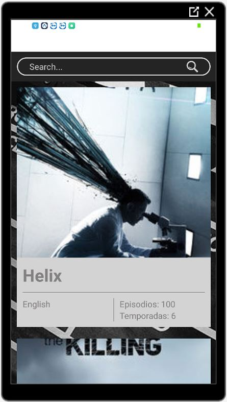
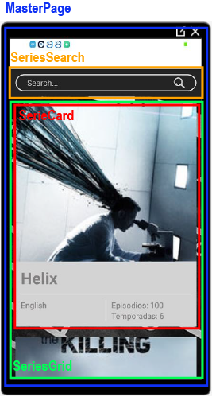
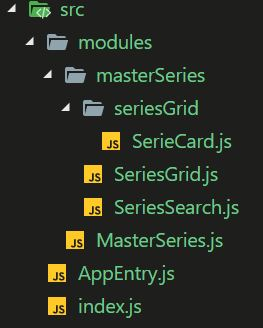
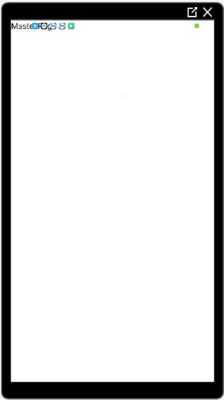

# Master page

Para comenzar con la aplicación tenemos que ver la descomposición de componentes que vamos a necesitar para crear nuestra aplicación. El objetivo es crear la siguiente aplicación móvil.



La descomposición de componentes seria la siguiente:




Con la estructura de componentes ya definida podemos crear la estructura de carpetas para los componentes.



En nuestro fichero **MasterSeries.js** vamos a crear el componente, vamos a necesitar que sea un componente de **clase** ya que mas a delante vamos a tener que hacer llamadas al API para traernos las series.

**MasterSeries.js**
```javascript
import React, { component, Component } from 'react';
import { View, Text } from 'react-native';

class MasterSeries extends Component {

    render() {
        return(
            <View>
                <Text>Master Page</Text>
            </View>
        );
    }
}

export { MasterSeries }
```

Ahora necesitamos añadir nuestro componente **MasterSeries** al **index.js** para que se renderice en pantalla.

**index.js**

```javascript
import React from 'react';
import { StyleSheet, Text, View } from 'react-native';

import { MasterSeries } from './modules/MasterSeries';

const App =  () => 
    <View>
        <MasterSeries />
    </View>

export { App }
```



Este sería el resultado, en la parte superior izquierda aparecerá el mensaje **Master Page** que hemos puesto en el componente.

