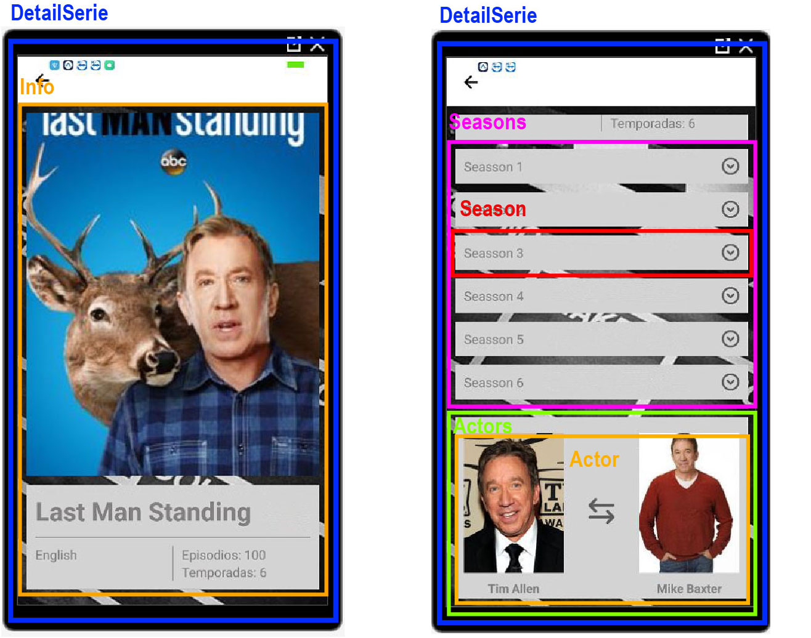

# Página de detalle

Ya tenemos la página con la lista de series, ahora vamos a hacer el detalle de ellas, el objetivo es el siguiente.



Una vez que tenemos el objetivo, podemos ponernos manos a la obra con ello.

Lo primero es crear el componente **DetailSerie**

```javascript
import React, { Component } from 'react';
import { Text } from 'react-native';

class DetailSerie extends Component {
    render() {
        return(<Text>Detail!</Text>);
    }
}

export { DetailSerie }
```

En este componente es desde donde mostraremos el detalle de las series que iremos haciendo en los siguientes pasos.

Con el componente ya creado, podmeos crear la ruta para renderizar esta vista.

**router.js**

```javascript
import React from 'react';
import { StackNavigator } from 'react-navigation';

import { MasterSeries } from './modules/MasterSeries';
import { DetailSerie } from './modules/DetailSerie';

const Router = StackNavigator({
    Main: {
        screen: MasterSeries
    },
    Detail: {
        path: 'series/:id',
        screen: DetailSerie
    }
},
{
    headerMode: 'screen', 
    cardStyle: {
        backgroundColor: 'transparent'
    }
});

export { Router };
```

Hemos añadido una ruta mas a nuestro **StackNavigator** llamada **Detail** la cuals e mostrará cuando el **path** sea **series/id**.

Con estos dos pasos tan sencillos hemos añadido una nueva pantalla a nuestra aplicación, ahora tenemos que conseguir navegar entra pantallas.

Para conseguir la navegación, tenemos que añadir un evento que nos permita navegar, la librería **react-navigation** nos inyecta una función que nos permite navegar entre páginas, el problema que tiene es que lo inyecta en el componente root de la pantalla lo que nos va a obligar a pasarlo hacía abajo como **prop** para poder ejecutarlo para cada **SerieCard**.

**MasterSeries.js**

```javascript
import React, { component, Component } from 'react';
import { View, Text } from 'react-native';

import axios from 'axios';

import { SeriesGrid } from './masterSeries/SeriesGrid';
import { SeriesSearch } from './masterSeries/SeriesSearch';

class MasterSeries extends Component {

    constructor() {
        super();
        this.state = {
            series: []
        }
    }

    componentDidMount() {
        axios.get('https://seriesexample.azurewebsites.net/api/series')
            .then(response => this.setState({ series: response.data }));
    }

    searchSeries(value) {
        axios.get(`https://seriesexample.azurewebsites.net/api/series?title=${value}`)
            .then(response => this.setState({ series: response.data}));
    }

    render() {
        console.log(this.props)
        return(
            <View>
                <SeriesSearch searchSeries={ this.searchSeries.bind(this) }/>
                <SeriesGrid series={ this.state.series } navigate={ this.props.navigation.navigate } />
            </View>
        );
    }
}

export { MasterSeries }
```

A nuestro componente **SeriesGrid** le hemos pasado una nueva **prop** que es la funcion que nos inyecta *react-navigation** y que nos permitirá haver una navegación.

**SeriesGrid.js**

```javascript
import React, { Component } from 'react';
import { FlatList } from 'react-native'
import { SerieCard } from './seriesGrid/SerieCard';

const SeriesGrid = ({ series, navigate }) =>
    <FlatList 
        data={ series }
        renderItem={ ({ item }) => <SerieCard serie={ item } navigate={ navigate }/> }
        keyExtractor={ (item) => item.id }
    />

export { SeriesGrid };
```

La prop que habíamos pasado hacía abajo la recogemos en nuestro componente **SeriesGrid** y se la pasamos hacía abajo a nuestro componente **SerieCard**

**SerieCard.js**

```javascript
import React from 'react';
import { View, Image, Text, TouchableWithoutFeedback, StyleSheet } from 'react-native';


const SerieCard = ({ serie, navigate }) =>
    <TouchableWithoutFeedback onPress={ () => navigate('Detail', { id: serie.id }) }>
        <View>
            <Image 
                style={ styles.serieImage }
                source={{
                    uri: serie.image.medium,
                    cache: 'only-if-cached',
                }}
            />
            <View>
                <Text>{ serie.title }</Text>
                <Text>{ serie.language }</Text>
            </View>
        </View>
    </TouchableWithoutFeedback> 

export { SerieCard };

const styles = StyleSheet.create({
    serieImage: {
        width: '100%', 
        height: 300
    }
});
```

Por último recogemos la **prop** en el componente **SereCard** y en este punto vamos a generar un botón para cuando se pulse lance la navegación.

Para ello vamos a usar el componente **TouchableWithoutFeedback** el cual nos permite pasarle una funcion cuando se haga un **onPress**, cuando se haga **onPress** vamos a ejecutar la función que hemos pasado como **prop** en la cual le vamos a indicar el nombre de la pantalla y en este caso le pasamos un objeto con los parametros del path, que va a ser el id de la serie.