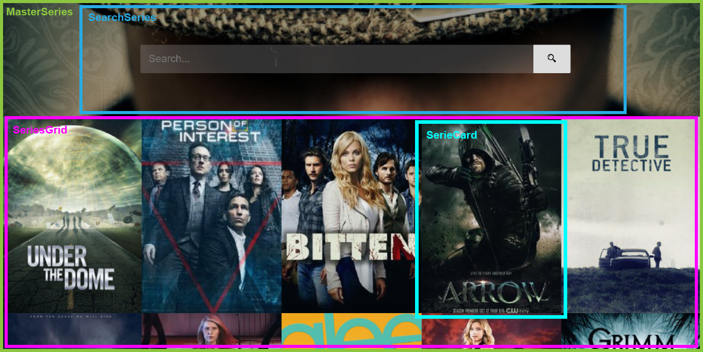

# Comenzando con la web Series

Lo primero que tenemos que hacer es pensar como vamos a separar nuestra aplicación en componentes mas pequeños.

Con una vista previa del desglose de los componentes de nuestra página, podemos crear la estructura de carpetas con los componentes que vamos a usar. En este caso vamos a usar una estructura de carpetas **Fractal**.